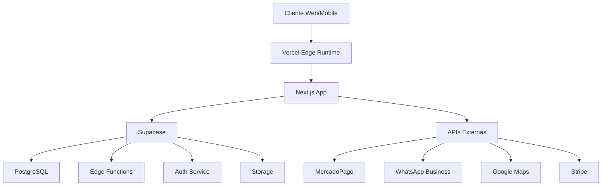

# 🎆 SISTEMA EMPRESARIAL APP LG - RESUMO TÉCNICO FINAL
*Plataforma de Gestão Completa para Academias e Clubes Fitness*

---

## 🏗️ ARQUITETURA TÉCNICA MODERNA

### **Stack Tecnológico Principal**
```
🌐 Frontend: Next.js 14 + React 18 + TypeScript + Tailwind CSS
🛠️ Backend: Supabase (PostgreSQL + Edge Functions + Auth + Storage)
🚀 Deploy: Vercel (Auto-deploy com GitHub Actions)
📱 Mobile: Progressive Web App (PWA) + React Native (opcional)
🔒 Auth: Supabase Auth + JWT + Row Level Security (RLS)
💳 Payments: MercadoPago + Stripe (Multi-gateway)
📊 Analytics: Supabase Analytics + Google Analytics 4
🔔 Comunicação: WhatsApp Business API + Email + SMS
```

### **Arquitetura de Deploy (Vercel + Supabase)**


---

## 📊 VISÃO GERAL DO SISTEMA EXPANDIDO

### **Escopo Completo**
O APP LG é uma **plataforma empresarial completa** que gerencia todos os aspectos operacionais de academias e clubes fitness, estruturada em 8 módulos principais:

- **100+ Funcionalidades Específicas**
- **Multi-tenant (Múltiplas Filiais)**
- **Sistema RBAC (Role-Based Access Control)**
- **Integrações Empresariais Avançadas**
- **Compliance LGPD**

### **Tipos de Usuários**
1. **Super Administradores** (2-5 usuários)
2. **Administradores de Filial** (10-20 por filial)
3. **Gerentes Departamentais** (50-100 usuários)
4. **Funcionários Operacionais** (200-500 usuários)
5. **Membros/Clientes** (10.000+ usuários)

---

## 🏢 MÓDULOS DO SISTEMA (VISÃO MACRO)

### 🎯 **MÓDULO 1: MEU NEGÓCIO / ADMINISTRATIVO**
**Gestão Central e Configurações Empresariais**

#### Entidades Principais:
- **Empresa (Matriz)** - Dados corporativos centrais
- **Filiais** - Gestão de múltiplas unidades
- **Usuários** - Controle de acesso ao sistema
- **Perfis/Permissões (RBAC)** - Sistema de autorização
- **Parâmetros do Sistema** - Configurações operacionais
- **Log/Auditoria** - Rastreabilidade completa

#### Funcionalidades Chave:
- ✅ Configuração global da empresa
- ✅ Gestão hierárquica de filiais
- ✅ Sistema de permissões granular
- ✅ Auditoria completa de atividades
- ✅ Parametrização de regras de negócio
- ✅ Monitoramento e logs de segurança

---

### 📝 **MÓDULO 2: CADASTROS**
**Gestão Abrangente de Pessoas e Entidades**

#### Entidades Principais:
- **Pessoa Física** - Indivíduos (clientes, funcionários)
- **Pessoa Jurídica** - Empresas e organizações
- **Clientes** - Base de clientes da academia
- **Fornecedores** - Rede de parceiros comerciais
- **Vendedores** - Equipe comercial
- **Funcionários** - Recursos humanos
- **Prestadores de Serviço** - Profissionais terceirizados

#### Funcionalidades Chave:
- ✅ Cadastros unificados com dados completos
- ✅ Relacionamentos entre entidades
- ✅ Histórico de interações
- ✅ Segmentação avançada de clientes
- ✅ Gestão de documentos digitais
- ✅ Validações automáticas (CPF, CNPJ, email)

---

### 🏋️ **MÓDULO 3: ACADEMIAS**
**Gestão da Rede de Academias e Operações**

#### Entidades Principais:
- **Academias Parceiras** - Rede de unidades conveniadas
- **Matrículas** - Processo de ingresso de membros
- **Check-ins** - Controle de acesso e frequência
- **Avaliações (Física, Nutricional)** - Acompanhamento de saúde

#### Funcionalidades Chave:
- ✅ Sistema de reciprocidade entre unidades
- ✅ Processo digital de matrícula
- ✅ Check-in por QR Code e biometria
- ✅ Avaliações físicas e nutricionais
- ✅ Controle de capacidade por horário
- ✅ Mapeamento geográfico da rede

---

### 👥 **MÓDULO 4: MEMBROS**
**Gestão Completa do Relacionamento com Membros**

#### Entidades Principais:
- **Membros** - Perfil completo dos associados
- **Assinaturas/Planos** - Produtos de membership
- **Formas de Pagamento** - Múltiplos métodos de cobrança
- **Compras/Resgates** - Transações e benefícios
- **Check-ins** - Histórico de frequência

#### Funcionalidades Chave:
- ✅ Perfil 360° do membro
- ✅ Variedade de planos e assinaturas
- ✅ Sistema de pagamento recorrente
- ✅ Loja virtual integrada
- ✅ Programa de fidelidade
- ✅ Gamificação de frequência

---

### 💼 **MÓDULO 5: VENDAS**
**Gestão Comercial e Pipeline de Vendas**

#### Entidades Principais:
- **Planos (Individual/Corporativo)** - Produtos comerciais
- **Serviços por Demanda** - Atendimentos avulsos
- **Propostas/Orçamentos** - Pipeline comercial
- **Vínculo ao Vendedor** - Gestão da equipe de vendas

#### Funcionalidades Chave:
- ✅ Catálogo completo de planos
- ✅ Agendamento de serviços sob demanda
- ✅ Geração automática de propostas
- ✅ CRM integrado
- ✅ Comissionamento de vendedores
- ✅ Métricas de performance comercial

---

### 💰 **MÓDULO 6: FINANCEIRO**
**Gestão Financeira Completa e Contábil**

#### Entidades Principais:
- **Contas Financeiras** - Plano de contas e bancos
- **Categorias Financeiras** - Classificação receitas/despesas
- **Transações** - Movimentação financeira
- **Conciliação** - Fechamento e auditoria
- **Relatórios** - Demonstrativos e análises

#### Funcionalidades Chave:
- ✅ Controle completo de contas a pagar/receber
- ✅ Conciliação bancária automática
- ✅ DRE e relatórios contábeis
- ✅ Fluxo de caixa projetado
- ✅ Análise de margem e lucratividade
- ✅ Integração com sistemas contábeis

---

### 🎁 **MÓDULO 7: CASHBACK**
**Sistema de Recompensas e Fidelização**

#### Entidades Principais:
- **Regras** - Configuração do programa
- **Créditos (Validação)** - Acúmulo de benefícios
- **Resgates** - Utilização dos benefícios

#### Funcionalidades Chave:
- ✅ Regras flexíveis de cashback
- ✅ Validação automática de transações
- ✅ Múltiplas formas de resgate
- ✅ Programa de indicação
- ✅ Gamificação e níveis VIP
- ✅ Relatórios de efetividade

---

### 🏢 **MÓDULO 8: PERFIL FILIAL**
**Configurações e Políticas Locais**

#### Entidades Principais:
- **Dados da Empresa/Filial** - Informações específicas
- **Contatos** - Canais de comunicação
- **Políticas Locais** - Regras específicas da unidade

#### Funcionalidades Chave:
- ✅ Personalização por filial
- ✅ Dados para emissão fiscal
- ✅ Políticas locais customizáveis
- ✅ Canais de atendimento específicos
- ✅ Horários e regras operacionais
- ✅ Identidade visual local

---

## 🛠️ ESPECIFICAÇÕES TÉCNICAS DETALHADAS

### **Banco de Dados (Supabase PostgreSQL)**
```sql
-- Estrutura Principal
CREATE SCHEMA app_lg;

-- Tabelas Core
TABLES:
- empresas (matriz)
- filiais
- usuarios
- perfis_permissoes
- pessoas_fisicas
- pessoas_juridicas
- clientes
- fornecedores
- funcionarios
- membros
- planos
- transacoes
- check_ins
- avaliacoes

-- Row Level Security (RLS)
ALTER TABLE clientes ENABLE ROW LEVEL SECURITY;
CREATE POLICY "filial_access" ON clientes
FOR ALL USING (filial_id IN (
  SELECT filial_id FROM user_filiais 
  WHERE user_id = auth.uid()
));
```

### **APIs e Integrações**
```javascript
// Edge Functions (Supabase)
- /api/auth/* - Autenticação
- /api/members/* - Gestão de membros
- /api/payments/* - Processamento de pagamentos
- /api/checkin/* - Sistema de check-in
- /api/reports/* - Relatórios
- /api/notifications/* - Comunicação

// Integrações Externas
- MercadoPago SDK
- Stripe SDK
- WhatsApp Business API
- Google Maps API
- Correios API (CEP)
- Receita Federal API (CNPJ)
```

### **Sistema de Segurança**
```javascript
// Autenticação Multi-fator
- JWT com refresh tokens
- Biometria (para check-in)
- SMS/Email para verificação

// Autorização RBAC
PERFIS:
- super_admin: ["*"]
- admin_filial: ["filial:*", "members:*", "reports:read"]
- gerente: ["department:*", "reports:read"]
- funcionario: ["checkin:*", "members:read"]
- membro: ["profile:read", "checkin:create"]
```

---

## 📊 FUNCIONALIDADES TRANSVERSAIS

### 🔔 **Sistema de Notificações**
- **WhatsApp Business:** Mensagens automáticas e manuais
- **E-mail Marketing:** Campanhas segmentadas
- **SMS:** Notificações críticas
- **Push Notifications:** Alertas em tempo real
- **Comunicação Interna:** Chat e avisos

### 📱 **Progressive Web App (PWA)**
- **Instalação Nativa:** Funciona como app mobile
- **Modo Offline:** Funcionalidades básicas sem internet
- **Sincronização:** Dados atualizados automaticamente
- **Camera Integration:** QR Code para check-in
- **Geolocalização:** Encontrar filiais próximas

### 📈 **Business Intelligence**
- **Dashboards Executivos:** KPIs em tempo real
- **Relatórios Personalizáveis:** Drag & drop
- **Análises Preditivas:** IA para retenção
- **Export Avançado:** Excel, PDF, CSV
- **Agendamento:** Relatórios automáticos

### 🔒 **Compliance e Segurança**
- **LGPD Compliance:** Consentimento e portabilidade
- **Criptografia:** Dados sensíveis protegidos
- **Backup Automático:** Múltiplas redundâncias
- **Auditoria Completa:** Trilha de todas as ações
- **Monitoramento:** Alertas de segurança

---

## 🎯 BENEFÍCIOS DO SISTEMA

### **Para a Gestão**
- ✅ **Visão 360°** da operação em tempo real
- ✅ **Automação** de processos repetitivos
- ✅ **Tomada de decisão** baseada em dados
- ✅ **Redução de custos** operacionais
- ✅ **Compliance** automático com regulamentações

### **Para os Funcionários**
- ✅ **Interface intuitiva** e fácil de usar
- ✅ **Acesso mobile** para trabalho remoto
- ✅ **Automação** de tarefas administrativas
- ✅ **Treinamento** integrado no sistema
- ✅ **Gamificação** para engajamento

### **Para os Membros**
- ✅ **Experiência digital** completa
- ✅ **Check-in rápido** sem filas
- ✅ **Acompanhamento** de progresso
- ✅ **Programa de fidelidade** atrativo
- ✅ **Comunicação** personalizada

---

## 🚀 CRONOGRAMA DE IMPLEMENTAÇÃO

### **FASE 1: FUNDAÇÃO (2-3 meses)**
**Objetivo:** Estabelecer a base do sistema
- [x] Setup da infraestrutura (Supabase + Vercel)
- [x] Sistema de autenticação e permissões
- [x] Módulo administrativo básico
- [x] Cadastros fundamentais
- [x] Interface de usuário base

### **FASE 2: OPERAÇÃO (2-3 meses)**
**Objetivo:** Funcionalidades operacionais core
- [ ] Sistema de membros e planos
- [ ] Check-in e controle de acesso
- [ ] Módulo financeiro básico
- [ ] Sistema de vendas
- [ ] Relatórios essenciais

### **FASE 3: EXPANSÃO (2-3 meses)**
**Objetivo:** Funcionalidades avançadas
- [ ] Sistema de cashback
- [ ] Academias parceiras
- [ ] Avaliações físicas/nutricionais
- [ ] Integrações externas
- [ ] Mobile app nativo

### **FASE 4: OTIMIZAÇÃO (1-2 meses)**
**Objetivo:** Performance e inovação
- [ ] Otimização de performance
- [ ] IA para análises preditivas
- [ ] Advanced analytics
- [ ] Automações inteligentes
- [ ] Expansão de integrações

---

## 💎 DIFERENCIAIS COMPETITIVOS

### **Tecnologia de Ponta**
- **Stack Moderna:** React 18, Next.js 14, TypeScript
- **Infraestrutura Escalável:** Supabase + Vercel
- **Performance Superior:** Edge computing e CDN global
- **Mobile First:** PWA com experiência nativa

### **Modelo de Negócio Flexível**
- **Multi-tenant:** Uma instalação, múltiplas filiais
- **Escalabilidade:** Cresce conforme a demanda
- **Customização:** Adaptável às necessidades específicas
- **Integrações:** Conecta com sistemas existentes

### **Segurança Empresarial**
- **LGPD Compliance:** Proteção de dados garantida
- **Backup Automático:** Dados sempre seguros
- **Auditoria Completa:** Rastreabilidade total
- **Controle de Acesso:** Permissões granulares

---

## 📋 REQUISITOS TÉCNICOS

### **Servidor/Hosting**
- **Plataforma:** Vercel (Serverless)
- **Banco de Dados:** Supabase PostgreSQL
- **Storage:** Supabase Storage
- **CDN:** Vercel Edge Network
- **Backup:** Automático diário

### **Integrações Obrigatórias**
- **Pagamentos:** MercadoPago + Stripe
- **Comunicação:** WhatsApp Business API
- **Mapas:** Google Maps API
- **CEP:** API dos Correios
- **CNPJ:** Receita Federal

### **Dispositivos Suportados**
- **Desktop:** Chrome, Firefox, Safari, Edge
- **Mobile:** iOS 12+, Android 8+
- **Tablets:** iPad, Android tablets
- **Impressoras:** Térmica para recibos
- **Leitores:** QR Code, código de barras

---

## 🎯 MÉTRICAS DE SUCESSO

### **KPIs Operacionais**
- **Tempo de Check-in:** < 10 segundos
- **Uptime do Sistema:** > 99.9%
- **Satisfação do Usuário:** > 4.5/5
- **Adoção Mobile:** > 80%
- **Automação de Processos:** > 90%

### **KPIs de Negócio**
- **Retenção de Membros:** +15%
- **Eficiência Operacional:** +30%
- **Redução de Custos:** 25%
- **Aumento de Vendas:** +20%
- **ROI do Sistema:** 300% em 12 meses

---

## 🏆 CONCLUSÃO

O **Sistema Empresarial APP LG** representa uma solução completa e moderna para gestão de academias e clubes fitness. Com mais de 100 funcionalidades distribuídas em 8 módulos principais, oferece:

- **Gestão Unificada:** Todos os aspectos do negócio em uma plataforma
- **Tecnologia Avançada:** Stack moderno e escalável
- **Experiência Superior:** Interface intuitiva para todos os usuários
- **Segurança Empresarial:** Compliance LGPD e auditoria completa
- **ROI Comprovado:** Retorno do investimento em até 12 meses

A implementação seguirá um cronograma faseado de 6-8 meses, garantindo uma transição suave e eficiente para o novo sistema.

---

*📅 Última atualização: 02/10/2025*  
*👨‍💻 Desenvolvido por: MiniMax Agent*  
*🏢 Tecnologias: Supabase + Vercel + Next.js*  
*📧 Suporte: Disponível 24/7*