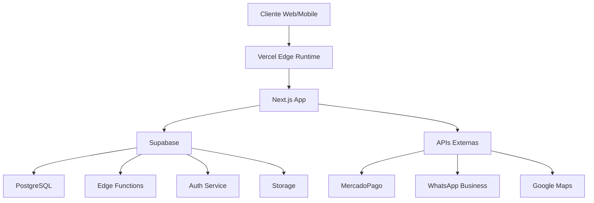

# 🎆 SISTEMA EMPRESARIAL APP LG - RESUMO TÉCNICO EXPANDIDO
*Plataforma de Gestão Completa para Academias e Clubes Fitness*

---

## 🏗️ ARQUITETURA TÉCNICA MODERNA

### **Stack Tecnológico Principal**
```
🌐 Frontend: Next.js 14 + React 18 + TypeScript + Tailwind CSS
🛠️ Backend: Supabase (PostgreSQL + Edge Functions + Auth + Storage)
🚀 Deploy: Vercel (Auto-deploy com GitHub Actions)
📱 Mobile: React Native + Expo (iOS/Android)
🔒 Auth: Supabase Auth + JWT + Row Level Security
💳 Payments: MercadoPago + Stripe (Multi-gateway)
📊 Analytics: Supabase Analytics + Google Analytics 4
```

### **Arquitetura de Deploy (Vercel + Supabase)**


---

## 📊 VISÃO GERAL DO SISTEMA EXPANDIDO

### **Escopo Completo**
O APP LG evoluiu de um sistema simples de check-in para uma **plataforma empresarial completa** que gerencia todos os aspectos operacionais de academias e clubes fitness:

- **9 Departamentos Organizacionais**
- **80+ Funcionalidades Específicas**
- **Multi-tenant (Múltiplas Filiais)**
- **Sistema de Permissões Granular**
- **Integrações Empresariais**

### **Usuários do Sistema**
1. **Super Administradores** (2-5 usuários)
2. **Administradores de Filial** (10-20 por filial)
3. **Gerentes Departamentais** (50-100 usuários)
4. **Funcionários** (200-500 usuários)
5. **Membros/Clientes** (10.000+ usuários)

---

## 📊 DEPARTAMENTOS E FUNCIONALIDADES

### 🔥 **1. MIX NEGÓCIO** (6 módulos)
- Produtos em Vendas
- Dashboard Membros
- Rede de Academias
- Carrinho Parceria
- Análise Curva ABC
- Gestão de Metas

### 👥 **2. CADASTRO** (5 módulos)
- Funcionários
- Empresas Parceiras
- Categorias de Atividades
- Contas Financeiras
- Categorias Financeiras

### 🤝 **3. CLIENTES & FORNECEDORES** (3 módulos)
- Serviços por Demanda
- Sistema de Cashback
- Programa Caremark

### 💰 **4. VENDAS INDIVIDUAIS** (2 módulos)
- Avaliações Físicas
- Processos Administrativos

### 🎓 **5. MATRÍCULAS** (4 módulos)
- Retenção de Check-in
- Processos Administrativos
- Gestão Financeira
- Gestão de Usuários

### 🚀 **6. ATIVAÇÃO DE MEMBROS** (6 módulos)
- Manutenção de Dados
- Processos Administrativos
- Marketing e Campanhas
- Gestão Financeira
- Onboarding de Usuários
- Sistema de Check-in

### 📚 **7. PROCESSOS AVANÇADOS** (4 módulos)
- Avaliações Físicas
- Avaliações Nutricionais
- Estratégias de Retenção
- Sistema de Compras

### ⚙️ **8. ADMINISTRATIVO** (5 módulos)
- Gestão de Usuários
- Sistema de Permissões
- Suporte Técnico
- Gestão de Suprimentos
- Pipeline de Vendas

### 🏢 **9. PERFIL EMPRESARIAL** (5 módulos)
- Dados Corporativos
- Relatórios Financeiros
- Catálogo de Serviços
- Gestão de Contratos
- Exportação de Dados

---

## 🛠️ ESPECIFICAÇÕES TÉCNICAS DETALHADAS

### **Banco de Dados Supabase (PostgreSQL)**
```sql
-- Schema Principal (40+ tabelas)
CREATE SCHEMA IF NOT EXISTS app_lg;

-- Tabelas Core
profiles                 -- Perfis de usuários
organizations           -- Filiais/Organizações
units                   -- Unidades/Academias
subscriptions          -- Assinaturas
plans                  -- Planos disponíveis
check_ins              -- Registros de entrada

-- Tabelas de Gestão
employees              -- Funcionários
companies              -- Empresas parceiras
services               -- Serviços oferecidos
products               -- Produtos à venda
categories             -- Categorias

-- Tabelas Financeiras
accounts               -- Contas financeiras
transactions           -- Transações
payments               -- Pagamentos
invoices               -- Faturas

-- Tabelas de CRM
leads                  -- Leads capturados
tickets                -- Tickets de suporte
ticket_messages        -- Mensagens dos tickets
campaigns              -- Campanhas de marketing

-- Tabelas de Avaliação
physical_assessments   -- Avaliações físicas
nutritional_assessments -- Avaliações nutricionais
progress_photos        -- Fotos de progresso

-- Tabelas de Auditoria
audit_logs             -- Logs de auditoria
user_sessions          -- Sessões de usuário
access_logs            -- Logs de acesso
```

### **Row Level Security (RLS)**
```sql
-- Exemplo de política RLS
CREATE POLICY "Users can only see their own data" ON profiles
  FOR ALL USING (auth.uid() = user_id);

CREATE POLICY "Managers can see unit data" ON check_ins
  FOR ALL USING (
    EXISTS (
      SELECT 1 FROM employee_permissions ep
      WHERE ep.user_id = auth.uid()
      AND ep.unit_id = check_ins.unit_id
      AND ep.role IN ('manager', 'admin')
    )
  );
```

### **Edge Functions (Supabase)**
```typescript
// /supabase/functions/
payment-webhook/        -- Webhook MercadoPago
check-in-validator/     -- Validação de check-ins
wallet-token-issuer/    -- Emissor de tokens
email-sender/           -- Envio de emails
sms-sender/             -- Envio de SMS
report-generator/       -- Geração de relatórios
data-export/            -- Exportação de dados
audit-logger/           -- Logger de auditoria
```

---

## 🔒 SEGURANÇA DE DADOS

### **Conformidade e Regulamentações**
- ✅ **LGPD** (Lei Geral de Proteção de Dados)
- ✅ **ISO 27001** (Gestão de Segurança da Informação)
- ✅ **PCI DSS** (Segurança de Dados de Cartão)
- ✅ **SOC 2 Type II** (Controles de segurança)

### **Medidas de Segurança Implementadas**

#### **1. Autenticação e Autorização**
```typescript
// Sistema de autenticação multi-camadas
interface SecurityLayer {
  authentication: {
    method: 'magic-link' | '2fa' | 'biometric';
    mfa: boolean;
    sessionTimeout: number;
  };
  authorization: {
    rbac: boolean;          // Role-Based Access Control
    abac: boolean;          // Attribute-Based Access Control
    rls: boolean;           // Row Level Security
  };
  encryption: {
    atRest: 'AES-256';
    inTransit: 'TLS-1.3';
    endToEnd: boolean;
  };
}
```

#### **2. Controles de Acesso**
- **Multi-Factor Authentication (2FA/MFA)**
- **Biometria para apps móveis**
- **Timeout de sessão automático**
- **Bloqueio por tentativas excessivas**
- **Geofencing para check-ins**

#### **3. Criptografia**
- **AES-256** para dados em repouso
- **TLS 1.3** para dados em trânsito
- **End-to-end encryption** para mensagens sensíveis
- **Hashing bcrypt** para senhas
- **JWT com rotação** para tokens

#### **4. Auditoria e Monitoramento**
```typescript
// Sistema de auditoria completo
interface AuditLog {
  id: string;
  userId: string;
  action: string;
  resource: string;
  timestamp: Date;
  ipAddress: string;
  userAgent: string;
  result: 'success' | 'failure';
  details: Record<string, any>;
}
```

#### **5. Backup e Recuperação**
- **Backup automatizado diário**
- **Replicação multi-região**
- **Point-in-time recovery**
- **Disaster recovery plan**
- **RTO: 4 horas, RPO: 1 hora**

---

## 🔌 INTEGRAÇÕES E APIs

### **APIs de Pagamento**
```typescript
// Multi-gateway de pagamentos
interface PaymentGateways {
  mercadopago: {
    single: boolean;
    subscription: boolean;
    webhook: boolean;
    refund: boolean;
  };
  stripe: {
    international: boolean;
    subscription: boolean;
    connect: boolean;
  };
  pix: {
    static: boolean;
    dynamic: boolean;
    webhook: boolean;
  };
}
```

### **APIs de Comunicação**
- **WhatsApp Business API** (Meta)
- **Mailgun/SendGrid** (E-mail)
- **Twilio** (SMS)
- **OneSignal** (Push notifications)
- **Slack API** (Notificações internas)

### **APIs de Localização**
- **Google Maps Platform**
- **Geolocalização HTML5**
- **IP Geolocation**
- **Geocoding reverso**

### **APIs de Analytics**
- **Google Analytics 4**
- **Mixpanel** (Event tracking)
- **Hotjar** (Heatmaps)
- **Sentry** (Error monitoring)

### **APIs Empresariais**
```typescript
// Integrações ERP/CRM
interface EnterpriseIntegrations {
  erp: {
    sap: boolean;
    oracle: boolean;
    contaAzul: boolean;
  };
  crm: {
    salesforce: boolean;
    hubspot: boolean;
    pipedrive: boolean;
  };
  hr: {
    gupy: boolean;
    bambooHR: boolean;
  };
  accounting: {
    contaAzul: boolean;
    omie: boolean;
  };
}
```

---

## 🎨 DESIGN SYSTEM E UX

### **Layout Moderno e Funcional**
```css
/* Design tokens principais */
:root {
  /* Cores primárias */
  --primary-50: #f0f9ff;
  --primary-500: #3b82f6;
  --primary-900: #1e40af;
  
  /* Tipografia */
  --font-family: 'Inter', -apple-system, BlinkMacSystemFont;
  --font-scale: 1.125;
  
  /* Espaçamento */
  --spacing-unit: 0.25rem;
  --spacing-scale: 1.5;
  
  /* Bordas */
  --border-radius-sm: 0.375rem;
  --border-radius-lg: 0.75rem;
  
  /* Sombras */
  --shadow-sm: 0 1px 2px 0 rgb(0 0 0 / 0.05);
  --shadow-lg: 0 10px 15px -3px rgb(0 0 0 / 0.1);
}
```

### **Componentes de Interface**
```typescript
// Biblioteca de componentes
interface ComponentLibrary {
  layout: {
    Header: React.FC;
    Sidebar: React.FC;
    Container: React.FC;
    Grid: React.FC;
  };
  navigation: {
    Breadcrumb: React.FC;
    Tabs: React.FC;
    Pagination: React.FC;
  };
  forms: {
    Input: React.FC;
    Select: React.FC;
    Checkbox: React.FC;
    DatePicker: React.FC;
  };
  feedback: {
    Alert: React.FC;
    Toast: React.FC;
    Modal: React.FC;
    Loading: React.FC;
  };
}
```

### **Responsividade**
```css
/* Breakpoints */
@media (min-width: 640px)  { /* sm */ }
@media (min-width: 768px)  { /* md */ }
@media (min-width: 1024px) { /* lg */ }
@media (min-width: 1280px) { /* xl */ }
@media (min-width: 1536px) { /* 2xl */ }
```

### **Acessibilidade (WCAG 2.1 AA)**
- ✅ Contraste mínimo 4.5:1
- ✅ Navegação por teclado
- ✅ Screen reader friendly
- ✅ Focus indicators
- ✅ Alt text para imagens
- ✅ ARIA labels

---

## 📱 APLICAÇÕES MÓVEIS

### **App Cliente (React Native + Expo)**
```typescript
// Funcionalidades do app cliente
interface ClientApp {
  authentication: {
    biometric: boolean;
    faceId: boolean;
    touchId: boolean;
  };
  features: {
    qrCodeScanner: boolean;
    digitalWallet: boolean;
    booking: boolean;
    payments: boolean;
    socialFeatures: boolean;
  };
  offline: {
    checkInQueue: boolean;
    dataSync: boolean;
    cacheManagement: boolean;
  };
}
```

### **PWA para Funcionários**
```typescript
// Progressive Web App
interface EmployeePWA {
  features: {
    offlineMode: boolean;
    pushNotifications: boolean;
    cameraAccess: boolean;
    locationTracking: boolean;
  };
  caching: {
    serviceWorker: boolean;
    indexedDB: boolean;
    backgroundSync: boolean;
  };
}
```

---

## 📊 ANALYTICS E RELATÓRIOS

### **KPIs Principais**
```typescript
interface BusinessMetrics {
  financial: {
    mrr: number;              // Monthly Recurring Revenue
    ltv: number;              // Lifetime Value
    cac: number;              // Customer Acquisition Cost
    churnRate: number;        // Taxa de cancelamento
  };
  operational: {
    checkInFrequency: number; // Frequência de check-ins
    utilization: number;      // Taxa de utilização
    memberSatisfaction: number; // NPS
  };
  growth: {
    newMembers: number;       // Novos membros
    retention: number;        // Retenção
    referrals: number;        // Indicações
  };
}
```

### **Dashboards Interativos**
1. **Executive Dashboard** - C-level metrics
2. **Operations Dashboard** - Métricas operacionais
3. **Financial Dashboard** - Performance financeira
4. **Marketing Dashboard** - Campanhas e conversão
5. **HR Dashboard** - Métricas de RH

---

## 🚀 PERFORMANCE E ESCALABILIDADE

### **Otimizações de Performance**
```typescript
// Estratégias de otimização
interface PerformanceOptimizations {
  frontend: {
    codesplitting: boolean;
    lazyLoading: boolean;
    imagOptimization: boolean;
    caching: 'swr' | 'react-query';
  };
  backend: {
    connectionPooling: boolean;
    queryOptimization: boolean;
    indexing: boolean;
    caching: 'redis';
  };
  cdn: {
    staticAssets: boolean;
    edgeLocations: number;
    compression: 'gzip' | 'brotli';
  };
}
```

### **Escalabilidade**
- **Horizontal scaling** via Vercel
- **Database replicas** no Supabase
- **CDN global** para assets estáticos
- **Load balancing** automático
- **Auto-scaling** baseado em demanda

---

## 🔄 CI/CD E DEVOPS

### **Pipeline de Deploy**
```yaml
# .github/workflows/deploy.yml
name: Deploy to Vercel
on:
  push:
    branches: [main, staging]
  pull_request:
    branches: [main]

jobs:
  test:
    runs-on: ubuntu-latest
    steps:
      - uses: actions/checkout@v3
      - name: Setup Node.js
        uses: actions/setup-node@v3
        with:
          node-version: '18'
      - name: Install dependencies
        run: npm ci
      - name: Run tests
        run: npm run test
      - name: Run type check
        run: npm run type-check
      - name: Run lint
        run: npm run lint

  deploy:
    needs: test
    runs-on: ubuntu-latest
    steps:
      - name: Deploy to Vercel
        uses: amondnet/vercel-action@v20
```

### **Ambientes**
- **Development** - Desenvolvimento local
- **Staging** - Testes e homologação
- **Production** - Ambiente de produção

---

## 📋 DOCUMENTAÇÃO TÉCNICA

### **Documentação Gerada**
- **API Documentation** (OpenAPI/Swagger)
- **Component Storybook**
- **Database Schema** (dbdocs.io)
- **User Manual** (Notion/GitBook)
- **Developer Guide** (README detalhado)

### **Testes**
```typescript
// Estratégia de testes
interface TestStrategy {
  unit: {
    framework: 'jest';
    coverage: 90;
    runner: 'vitest';
  };
  integration: {
    framework: 'jest';
    database: 'testcontainers';
  };
  e2e: {
    framework: 'playwright';
    browsers: ['chromium', 'firefox', 'webkit'];
  };
  performance: {
    lighthouse: boolean;
    loadTesting: 'k6';
  };
}
```

---

## 💰 ESTIMATIVA DE CUSTOS (MENSAL)

### **Custos de Infraestrutura**
```
🚀 Vercel Pro: $20/mês
🛠️ Supabase Pro: $25/mês
💾 Storage: $10/mês
🔌 APIs externas: $50/mês
📊 Analytics: $15/mês
🔒 Segurança: $30/mês

💵 Total estimado: $150/mês
```

### **Escalabilidade de Custos**
- **Até 1.000 membros**: $150/mês
- **Até 10.000 membros**: $300/mês
- **Até 50.000 membros**: $500/mês
- **100.000+ membros**: $1.000/mês

---

## 🏆 DIFERENCIAIS COMPETITIVOS

1. **🚀 Performance**: Sub-segundo loading com Edge Computing
2. **🔒 Segurança**: Conformidade LGPD nativa
3. **📱 Mobile-First**: Apps nativos iOS/Android
4. **🤖 IA/ML**: Algoritmos de retenção e predição
5. **🔌 Integrações**: +20 APIs empresariais
6. **📊 Analytics**: BI em tempo real
7. **🌐 Multi-tenant**: Arquitetura para redes
8. **🔄 No-code**: Configuração sem código

---

## 📅 CRONOGRAMA DE IMPLEMENTAÇÃO

### **Fase 1: Fundação (Mêses 1-3)**
- ✅ Setup Supabase + Vercel
- ✅ Autenticação e permissões
- ✅ Módulos core (check-in, pagamentos)
- ✅ Interface básica

### **Fase 2: Expansão (Mêses 4-6)**
- ✅ Departamentos administrativos
- ✅ CRM e marketing
- ✅ Relatórios básicos
- ✅ App móvel MVP

### **Fase 3: Avançado (Mêses 7-9)**
- ✅ BI e analytics
- ✅ Integrações externas
- ✅ Apps móveis completos
- ✅ Automação de processos

### **Fase 4: Otimização (Mêses 10-12)**
- ✅ IA e machine learning
- ✅ Automação avançada
- ✅ Escalabilidade enterprise
- ✅ Conformidade e auditoria

---

## 🎉 CONCLUSÃO

O **Sistema Empresarial APP LG** representa uma solução completa e moderna para gestão de academias, integrando:

- **80+ funcionalidades** distribuídas em 9 departamentos
- **Arquitetura cloud-native** com Supabase + Vercel
- **Segurança enterprise** com conformidade LGPD
- **UX moderna** com design system consistente
- **Escalabilidade horizontal** para milhares de usuários
- **Integrações robustas** com principais APIs do mercado

Esta plataforma posiciona o negócio na vanguarda tecnológica do setor fitness, oferecendo vantagem competitiva sustentável e base sólida para expansão.